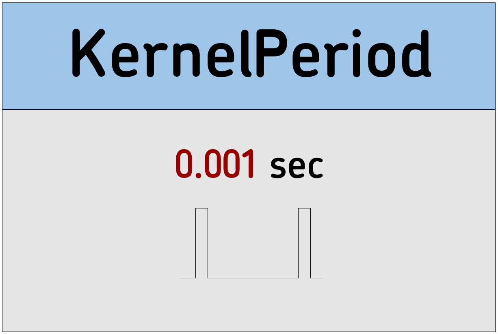

# KernelPeriod

Configures the nBlocksStudio Kernel `Tick` period 
<p align="center">

</p>  
  

----

>  *  Category: Configuration
>  *  HAL: mbed
>  *  Tested: with LPC1768
>  *  Author: F. Cosentino

## Implementation Details
This is a configuration Node without any connectios


## input/Output Connections ##

```
 *  No connections
```

## Node Parameters ##

```
 *  float:  Period in sec

```


## Usage Example ##

```
[KernelPeriod]
[Other]-->[Other]

```


